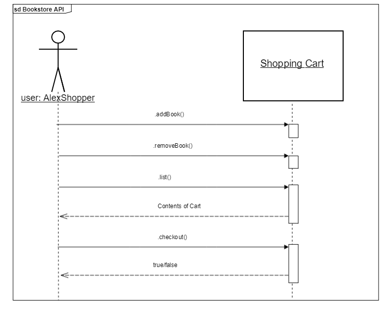

# Alex's-Bookstore-API
This is a developer guide for Alex's Bookstore API developed as a writing assignment for FIS Global. This is a fictional API. 

## Overview
This describes the methods that will allow you to implement the shopping cart for Alex's bookstore. The API is designed to allow customers to choose books, add or remove them from their shopping cart, and checkout when they are done. 

API Methods | Description
--- | ---
`.addBook(book)` | Adds an item to the cart. <br> Params: `string`
`.removeBook(book)` | Removes an item from the cart. <br> Params: `string`
`.checkout()` | Purchases the items in the cart. <br> Returns: `boolean`
`.list()` | Returns the contents of the cart. <br> Returns: `array(string)` 

## Programming Guidelines
**Getting Started**

A new user must be instantiated as a shopper for a shopping cart to be established for them.
```javascript
const user = new AlexShopper();
```
**Listing Items in the Cart**

This method will return all books that have been added to the shopping cart as an array of book titles.
```javascript
user.list();
// => ['BestSeller1', 'BestSeller2']
```

**Adding a Book**

This method adds a book to the shopping cart. The parameter is the title of the book being purchased. It returns the contents of the shopping cart as an array.
```javascript
user.addBook('BestSeller1');
user.list();
// => ['BestSeller1']
```
Currently `.addBook()` is only able to add one title at a time to the shopping cart. Call the method again for each new item.

**Removing a Book**

This method will remove a book from the cart. The parameter is the title of the book being removed.
```javascript
user.removeBook('BestSeller1');
user.list();
// => []
```

**Checkout**

This method will purchase all the books in the cart. This method returns true if the transaction is successful and the cart will become empty. Here is an example of a complete transaction:
```javascript
const user = new AlexShopper();
user.addBook('BestSeller1');
user.addBook('BestSeller2');
user.addBook('FantasyFic');
user.list();
// => ['BestSeller1', 'BestSeller2', 'FantasyFic']

user.removeBook('Bestseller2');
user.list();
// => ['BestSeller1', 'FantasyFic']

user.checkout();
// => true

user.list();
// => []
```
## Error Handling
This API will throw exceptions in the following conditions:

 * if `.removeBook` is called on an empty cart
 * if `.checkout` is called on an empty cart
 
Use a `try/catch` statement if you need to facilitate these exceptions. 

```javascript
try {
	const user = new AlexShopper();
	alex.checkout(); // throws new Error('Empty cart')
	
	alex.addBook('BestSeller1');
	alex.addBook('FantasyFic');
} catch(err) {
	console.log(err.message);
}
```
## Diagram

[Bookstore API Sequence Diagram in Gliffy](https://www.gliffy.com/go/publish/12165866)
